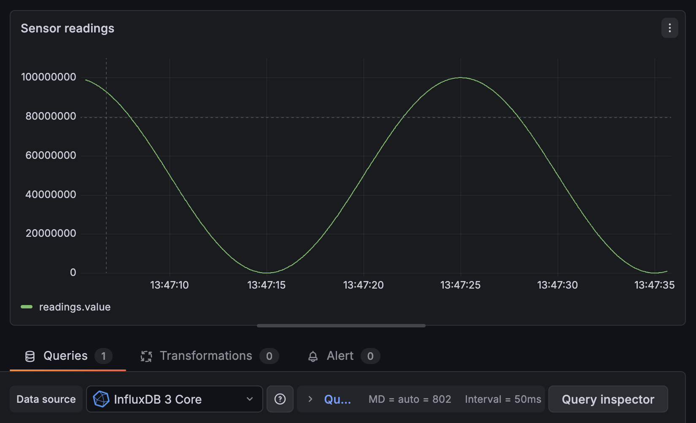

# Sensor experiment

A pet project with intention to refresh & broaden my rust knowledge through exploration.

## Setup

```bash
# not needed currently (to revisit, removed influxdb auth to pursue more of the feature slice)
# ./setup-dev.sh     # creates admin-token.json and ~/.influxdb3/data
docker compose up  # starts InfluxDB and initialises the database + table
# Run the simulation for 1 second, generating arbitrary sensor readings
cargo run --manifest-path crates/server/Cargo.toml -- --duration=1 simulated
# Or if developing / watch mode
cargo watch -x check -x test -x "run -- --duration=1 simulated"
# Open grafana (macos only)
open localhost:3000 # un/pw both 'admin'
```

InfluxDB dev token: `apiv3_dev-local-token`



## Architecture

Services:

- Ingest (rust app at crates/server)
- InfluxDB for storing readings (docker)
- Grafana (docker)

The current implementation:

- Simulates sensor readings
- Transforms them and writes them into influxdb via the influxdb client (crate)

**Missing**

- Metrics / Logging (via opentelemetry)

## Plan

Rough Client + Server model

- Client-1 (esp-32, rust): gather sensor data and send it over the wire (usb/uart?) to be ingested by ingestion process.
- Client-2: (web/nextjs/react). Display aggregated sensor data in a web view.
  - 1. button to rest query data in influxdb
  - 2. (stretch) shows hosts 'perspective' react component connecting to perspective rust server.
- DB (influxdb): persist and compute for sensor data.
- Server (rust):
  - Entrypoint-1: standalone process to persist data to db.
    - 1. persist data to influxdb
    - In future: also handle init/migrations etc.
  - Entrypoint-2: Axum w. Perspective
    - 1. Axum web server which serves an aggregated view of the data
    - 2. stretch: 'Perspective' view for dynamic queries

## Guiding principles

- Safe numeric conversions
- defensive programming (assert assumptions)
- LLM use - avoid Agentic coding in rust. Only use it like google to ask questions if/when stuck. Need the compiler to push back to internalise the info!

MVP / impl plan:

1.  Rust server which persists to db.

## Lessons

- InfluxDB WAL flush has a default of 1s causing each write to take 1s!
  - 1. reduce as per docs for local disks (or mark writes not requiring wal write)
  - 2. bigger batches & multiple concurrent writes in-flight
- Use '\_' instead of '-' in module names
- `fn to_x` is the convention for **borrowed** self `&self`, `fn into_x` **consumes** self
- Need to 'pin' tokio stream in order to run/consume from it
- Recommended to use 'thiserror' and 'anyhow' for error handling
- `wrappingAdd` can be used to be explicit about numeric ops behaviour

### Agentic code Registry

- init of influxdb for local dev. Reason: not main focus / plumbing
